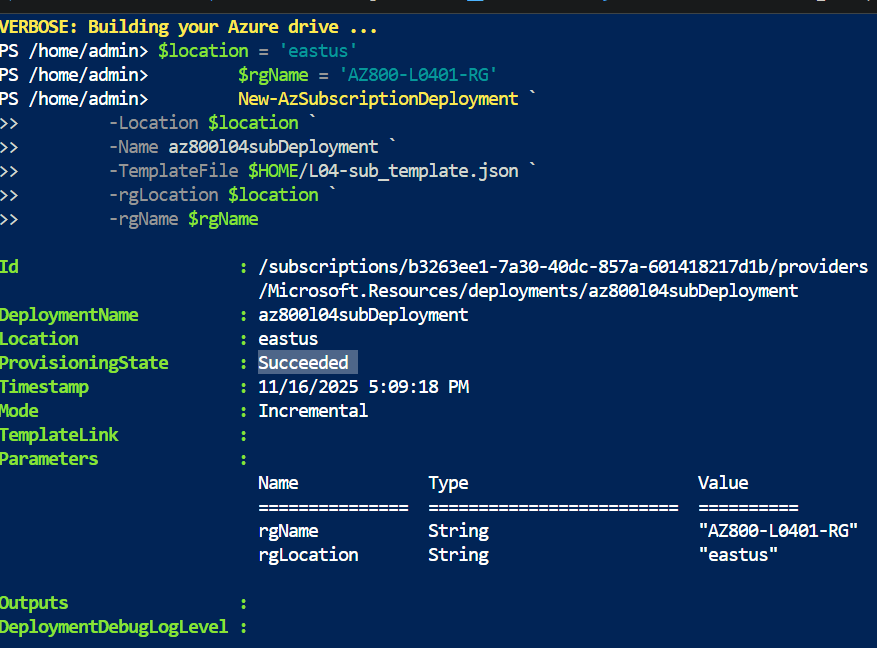
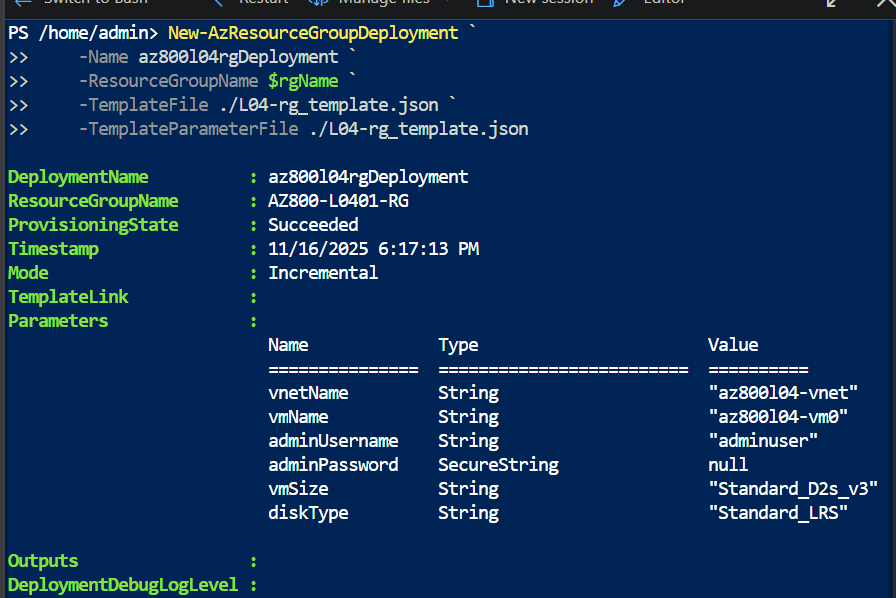
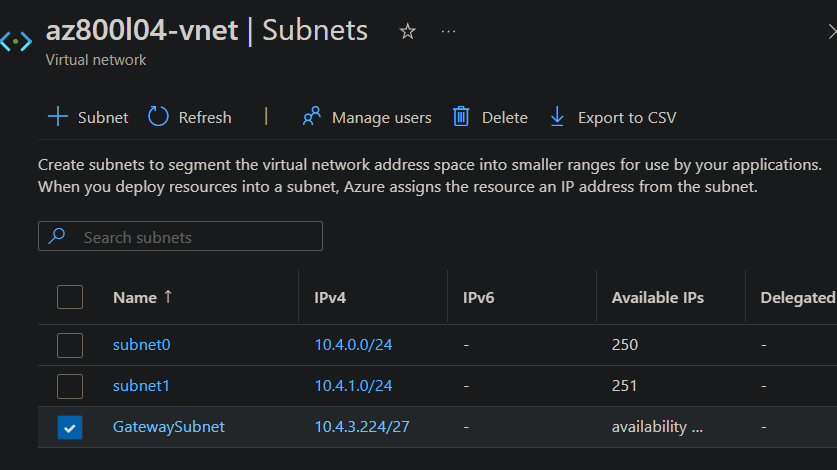
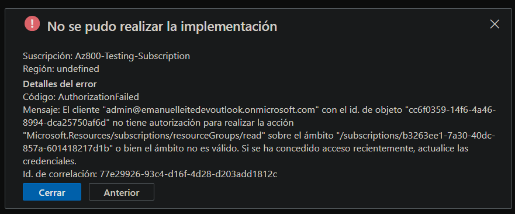

# Lab 04 — Using Windows Admin Center in hybrid scenarios

## Introduction
To address concerns regarding the consistent operational and management model—regardless of the location of managed systems, we need to validate Windows Admin Center (WAC) capabilities across hybrid environments.

This includes on-premises Windows Server installations and Azure virtual machines.

The primary goal of this lab is to use **WAC as a unified management plane** that works the same way whether systems run locally or in the cloud.

In this lab, I worked with the next AZ-800 skills:

### Administration of Windows Server workloads in a hybrid environment 
- Configure a target machine for Windows Admin Center  
- Configure remote PowerShell communication  
- Configure Kerberos delegation or CredSSP for second-hop remoting  
- Manage Windows servers using Azure Arc  
- Integrate Windows servers with Log Analytics  
- Integrate Windows servers with Microsoft Defender for Cloud  
- Administer Azure Virtual Machines running Windows Server  
- Implement Azure Automation for hybrid workloads  
- Create runbooks to automate tasks  

### Implementing and managing a hybrid and local network infrastructure
- Implement and manage Azure Network Adapter  
- Implement hybrid network connectivity  
- Configure and manage NVA-based routing between on-premises and Azure  
- Resolve connectivity issues across hybrid endpoints  

### Manage virtual machines and containers
- Manage Azure VM network configuration  
- Configure connections to Azure VMs (RDP, WinRM)  

### Active Directory Domain Services — Hybrid Identity 
- Administer authentication in hybrid environments  
- Integrate servers with Microsoft Entra ID via Arc onboarding  
- Configure Microsoft Entra authentication for WAC gateway access  

## Objetives
- Test hybrid connectivity by using Azure Network Adapter.
- Deploy WAC gateway on Azure.
- Verify the functionality of WAC gateway in Azure.

## Steps Performed

1. **Create an Azure resource group by using an Azure Resource Manager template**
    
    Begin by preparing an ARM template designed for a subscription-level deployment, whose purpose is to create a resource group within a specified subscription. In this case, we will use the file `L04-sub_template.json`.

    Next, open an Azure Cloud Shell session, upload the .json file, and run the following command:

        $location = 'eastus2'
        $rgName = 'AZ800-L0401-RG'
        New-AzSubscriptionDeployment `
        -Location $location `
        -Name az800l04subDeployment `
        -TemplateFile $HOME/L04-sub_template.json `
        -rgLocation $location `
        -rgName $rgName

    

2. **Create an Azure VM by using an Azure Reosurce Manager Template**

    We'll upload the `L04-rg_template.json` file, which contains the specifications for creating the Resource Group. Feel free to review its contents. After that, we'll proceed to create the remaining resources:

    - Public IP Address
    - SubNet Network Security Groups
    - VNet
    - Network Interface
    - Virtual Machine

    Then run the following command to deploy the resources:

        New-AzResourceGroupDeployment `
        -Name az800l04rgDeployment `
        -ResourceGroupName $rgName `
        -TemplateFile ./L04-rg_template.json `
        -TemplateParameterFile ./L04-rg_template.parameters.json

    

    >I modified a few parameters, locations, and variables in both `L04-rg_template.json` and `L04-sub_template.json` because, under the Azure trial subscription, deployment is limited to specific regions (such as eastus2) and lower SKUs.

3. **Adding a Gateway Subnet**

    Lasly, I added the IP address range `10.4.3.224/27` to the `az800l04-vnet` virtual network.

    

4. **Registering WAC with Azure**

    Now that we have setup the VM, we need to establish a hybrid connectivity between the on-premises server and the Azure VM created.
    For this purpose, we'll use the Azure Network Adapter feature of WAC.

    For this step, we'll make use tof `SEA-SVR1` with the WAC installed on `Lab3`, so I added a Azure Network Adapter from WAC.

## Troubleshooting / Errors Encountered

### Unable to open a Cloud Shell Session
I initially attempted to start a Cloud Shell session using a domain admin account. However, this account did not have either the Owner or Contributor role assigned at the subscription level. Because of this, it was unable to initialize a Cloud Shell session.

To resolve the issue, I signed in with an account that had Owner permissions and assigned the required roles (Owner or Contributor) to the domain admin user at the subscription level. After that, Cloud Shell started successfully.

## Documentation
- https://learn.microsoft.com/en-us/azure/azure-resource-manager/templates/overview
- https://learn.microsoft.com/en-us/azure/azure-resource-manager/templates/deploy-to-subscription?tabs=azure-cli
- https://learn.microsoft.com/en-us/azure/azure-resource-manager/templates/parameters
- https://learn.microsoft.com/en-us/azure/cloud-shell/overview