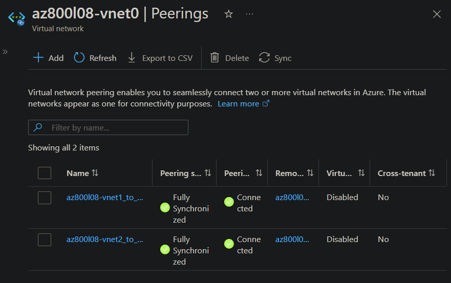
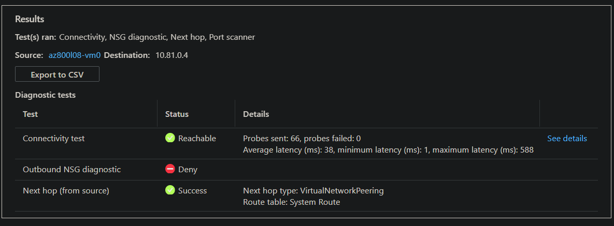
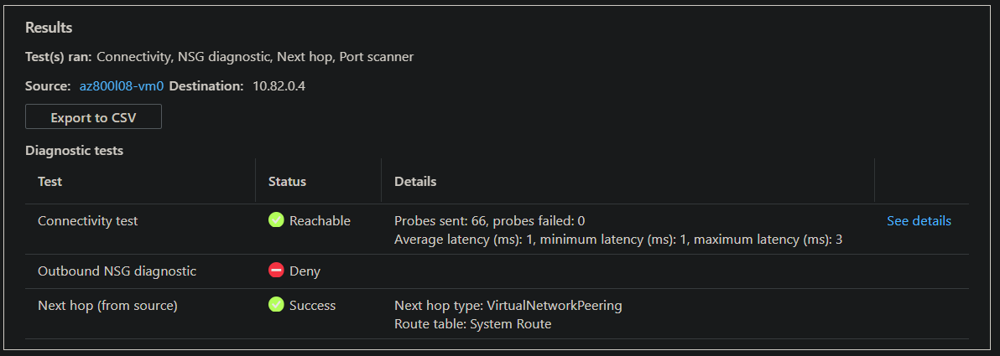
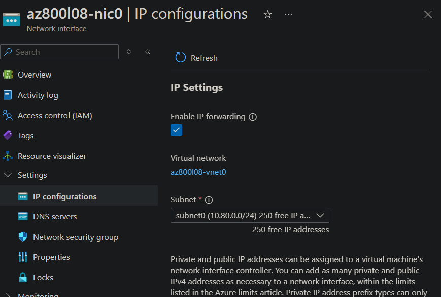
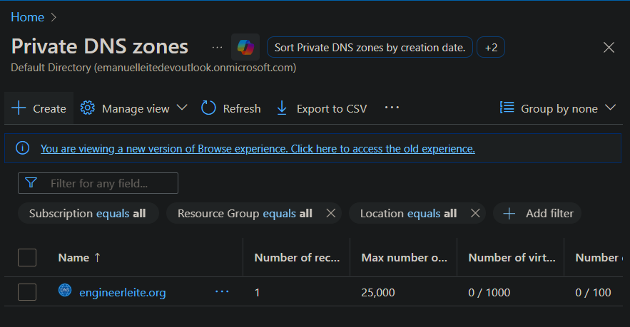
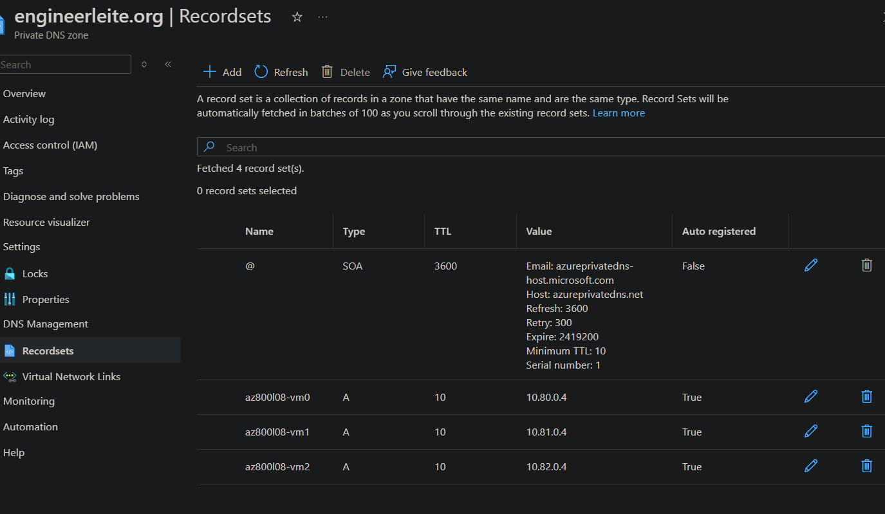
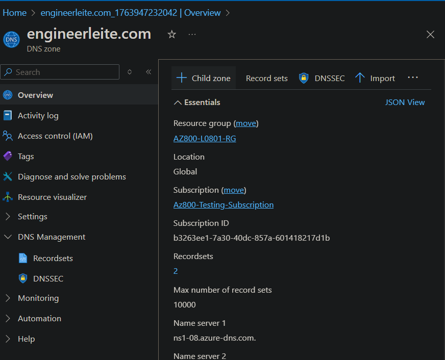

# Lab 08: Implementing hybrid networking infrastructure

## Introduction
In this test environment, we aim to deploy separate virtual networks and configure user-defined routes to control and direct traffic flow. Additionally, we will implement DNS name resolution for Azure virtual machines across virtual networks using Azure Private DNS Zones, and evaluate the use of Azure DNS Zones for external name resolution.

In this lab, I worked with the next AZ-800 skills:

### Implement on-premises and hybrid name resolution

    - Integrate Windows Server DNS with Azure Public DNS, Azure Private DNS, and Azure DNS Private Resolver

### Manage Windows Server virtual machines on Azure

    - Manage Azure VM network configuration

## Steps Performed

1. **Provision lab infrastructure resources**

    We'll start by creating the resources needed, for that I prepared the templates:

    - L08-rg_template.json
    - L08-rg_template.parameters.json

    And upload them on Cloud Shell from Azure Portal, then the following commands for deployment:

    ```powershell
    $location = 'eastus2'
    $rgName = 'AZ800-L0801-RG'
    New-AzResourceGroup -Name $rgName -Location $location

    New-AzResourceGroupDeployment `
   -ResourceGroupName $rgName `
   -TemplateFile $HOME/L08-rg_template.json `
   -TemplateParameterFile $HOME/L08-rg_template.parameters.json

    $rgName = 'AZ800-L0801-RG'
    $location = (Get-AzResourceGroup -ResourceGroupName $rgName).location
    $vmNames = (Get-AzVM -ResourceGroupName $rgName).Name

    foreach ($vmName in $vmNames) {
        Set-AzVMExtension `
        -ResourceGroupName $rgName `
        -Location $location `
        -VMName $vmName `
        -Name 'networkWatcherAgent' `
        -Publisher 'Microsoft.Azure.NetworkWatcher' `
        -Type 'NetworkWatcherAgentWindows' `
        -TypeHandlerVersion '1.4'
    }
    ```

2. **Configure the hub and spoke network topology**

    Then we'll set the below peerings on `az800l08-vnet0`, this will allow to seamlessly connect two or more virtual networks in Azure.

    | Setting | Value |
    | --- | --- |
    | This virtual network: Peering link name | **az800l08-vnet0_to_az800l08-vnet1** |
    | Traffic to remote virtual network | **Allow (default)** |
    | Traffic forwarded from remote virtual network | **Allow (default)** |
    | Virtual network gateway or Route Server | **None (default)** |
    | Remote virtual network: Peering link name | **az800l08-vnet1_to_az800l08-vnet0** |
    | Virtual network deployment model | **Resource manager** |
    | Remote virtual network: Virtual network | **az800l08-vnet1** |
    | Traffic to remote virtual network | **Allow (default)** |
    | Traffic forwarded from remote virtual network | **Allow (default)** |
    | Virtual network gateway | **None (default)** |

    And second one:

    | Setting | Value |
    | --- | --- |
    | This virtual network: Peering link name | **az800l08-vnet0_to_az800l08-vnet2** |
    | Traffic to remote virtual network | **Allow (default)** |
    | Traffic forwarded from remote virtual network | **Allow (default)** |
    | Virtual network gateway | **None (default)** |
    | Remote virtual network: Peering link name | **az800l08-vnet2_to_az800l08-vnet0** |
    | Virtual network deployment model | **Resource manager** |
    | Remote virtual network: Virtual network | **az800l08-vnet2** |
    | Traffic to remote virtual network | **Allow (default)** |
    | Traffic forwarded from remote virtual network | **Allow (default)** |
    | Virtual network gateway | **None (default)** |

    

3. **Test transitivity of virtual network peering**

    Network Watcher’s Connection Troubleshoot tool allows you to verify direct TCP or ICMP connectivity from a virtual machine (VM), Application Gateway v2, or Bastion host to another VM, FQDN, URI, or IP address.

    In this step, we use it to confirm that the virtual network peering is working as expected.

    I ran the first connection test from `vm0` to `vm1`, and the result confirms that the virtual machines can communicate with each other.

    

    I repeated the same test from `vm0` to `vm2`, with successful connectivity as well.

    

    Note that `10.81.0.4` is the private IP address of `vm1`, and `10.82.0.4` is the private IP of `vm2`.

4. **Configure routing in the hub and spoke topology**

    First enable the IP forwarding on `az800l08-nic0`.

    This setting is required in order for az800l08-vm0 to function as a router, which will route traffic between two spoke virtual networks.

    

    Now I need to configure the operating system of the `az800l08-vm0` virtual machine to support routing.

    I ran **RunPowerShellScript** on Operations and executed:

    ```powershell
    Install-WindowsFeature RemoteAccess -IncludeManagementTools

    Install-WindowsFeature -Name Routing -IncludeManagementTools -IncludeAllSubFeature
    Install-WindowsFeature -Name "RSAT-RemoteAccess-Powershell"
    Install-RemoteAccess -VpnType RoutingOnly
    Get-NetAdapter | Set-NetIPInterface -Forwarding Enabled
    ```

    These commands install and configure the Remote Access (RRAS) role on Windows Server and enable IP routing. They add the Routing feature, install the management tools, configure RRAS in routing-only mode, and turn on IP forwarding so the server can pass network traffic between different subnets. In short, they turn the server into a router.

    Next, I added a new route table as below:

    | Setting | Value |
    | --- | --- |
    | Route name | **az800l08-route-vnet1-to-vnet2** |
    | Address prefix destination | **IP Addresses** |
    | Destination IP Address/CIDR ranges | **10.82.0.0/20** |
    | Next hop type | **Virtual appliance** |
    | Next hop address | **10.80.0.4** |

    Then associate this route table to the virtual network `az800l08-vnet1` to `subnet0`

    Then create another route table:

    | Setting | Value |
    | --- | --- |
    | Resource group | **AZ800-L0801-RG** |
    | Name | **az800l08-rt12** |
    | Propagate gateway routes | **No** |

    On this resource, add the below route:

    | Setting | Value |
    | --- | --- |
    | Route name | **az800l08-route-vnet1-to-vnet2** |
    | Address prefix destination | **IP Addresses** |
    | Destination IP Address/CIDR ranges | **10.82.0.0/20** |
    | Next hop type | **Virtual appliance** |
    | Next hop address | **10.80.0.4** |

    Then create an association from `az800l08-vnet2` to `subnet0`.

    The finally by running another connection test we can expected the result as reachable because the traffic between spoke virtual networks is now route via the virtual machine located in the hub virtual network, which functions as a router.

5. **Configure Azure private DNS name resolution**

    Now we want to proceed with our next objetive, configure Azure private DNS name resolution. For that we navigate to **Private DNS zones** and create a new instance:

    

    On this instance, we added a virtual network link as below:

    | Setting | Value |
    | --- | --- |
    | Link name | **az800l08-vnet0-link** / **az800l08-vnet1-link** / **az800l08-vnet2-link** |
    | Virtual network | **az800l08-vnet0/1/2 (AZ800-L0801-RG)** |
    | Enable auto registration | selected |

    

6. **Validate Azure private DNS name resolution**

    We go back to Network Watcher and we can the connection troubleshoot to the destination `az800l08-vm2.engineerleite.org` and we can expect to return a fully qualified domain name is resolvable via the Azure private DNS zone.

7. **Configure Azure public DNS name resolution**

    Now it's time externable resolution name, on this case I'll use my own domain `engineerleite.com`.

    

    Then I'll add the below record set:

    | Setting | Value |
    | --- | --- |
    | Name | **www** |
    | Type | **A** |
    | Alias record set | **No** |
    | TTL | **1** |
    | TTL unit | **Hours** |
    | IP address | 20.30.40.50 |

    >**Note**: The IP address and the corresponding name are entirely arbitrary. They are meant to provide a very simple example illustrating implementing public DNS records, rather than emulate a real world scenario, which would require purchasing a namespace from a DNS registrar. 

    Finally, I noted the Name Server 1 for this domain: `ns1-08.azure-dns.com`.

8. **Validate Azure public DNS name resolution**

    To validate this public DNS name, we can only need to run this command in our on-prem server.

    ```powershell
    nslookup www.engineerleite.com ns1-08.azure-dns.com
    ```

    

## Troubleshooting / Errors Encountered

No errors were encountered on this lab :)

## Documentation

- https://learn.microsoft.com/en-us/azure/dns/private-dns-overview
- https://learn.microsoft.com/en-us/azure/dns/public-dns-overview
- https://learn.microsoft.com/en-us/training/modules/control-network-traffic-flow-with-routes/
- https://learn.microsoft.com/en-us/training/modules/introduction-to-azure-virtual-networks/
- https://learn.microsoft.com/en-us/azure/virtual-network/quickstart-create-virtual-network?tabs=portal