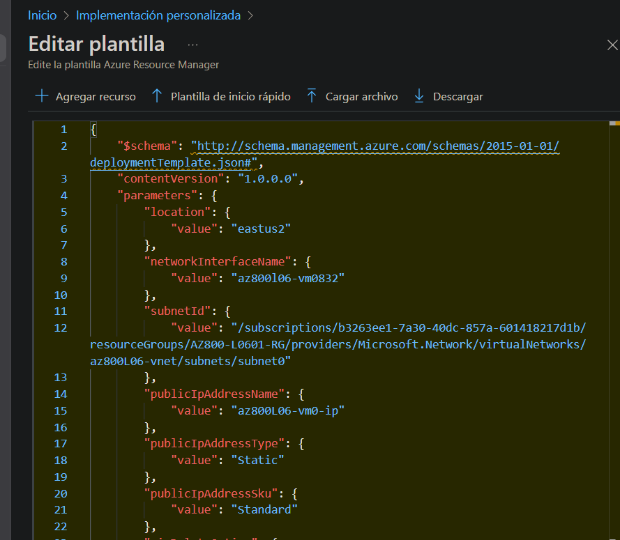
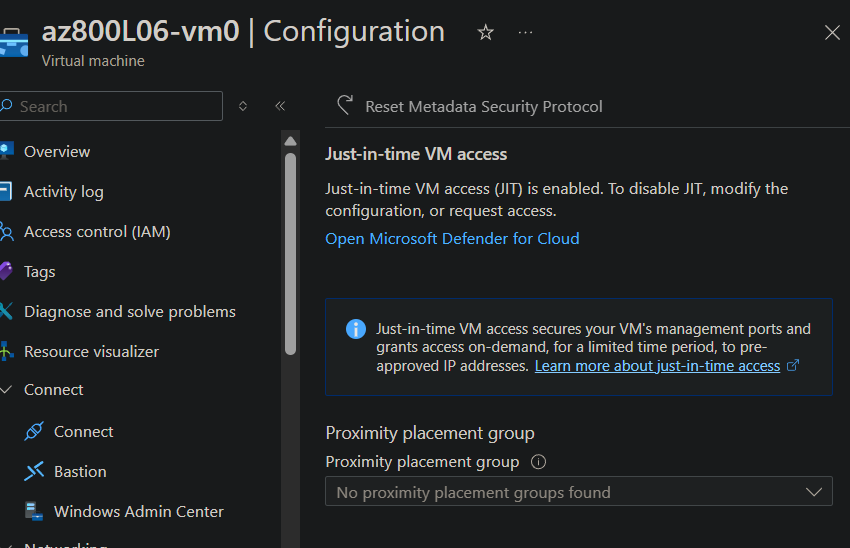

# Lab 06 - Deploying and configuring Windows Server on Azure VMs

## Introduction
One of the key advantages of Azure Virtual Machines is the ability to deploy and configure Windows Server instances quickly using automated processes. This typically involves the use of Azure Resource Manager (ARM) templates for deployment and Azure VM Extensions for OS-level configuration.

In this lab, we will also incorporate additional security mechanisms that go beyond traditional on-premises protections. These include application allowlisting with AppLocker, file integrity monitoring, adaptive network protections including DDoS mitigation, and the use of Just-In-Time (JIT) access to limit administrative connectivity to approved public IP ranges.

In summary, this lab focuses on deploying and configuring Azure VMs running Windows Server in a way that meets both manageability and security requirements.

In this lab, I worked with the next AZ-800 skills:

### Configure remote management for Windows Servers in a hybrid environment

    - Configure Just Enough Administration (JEA) for PowerShell remoting
    - Configure and manage remote SSH access
    - Configure and manage Remote Desktop Protocol (RDP) access

### Manage Windows Server virtual machines on Azure
    
    - Configure and manage Just in Time (JIT) VM access and Azure Bastion
    - Manage Azure VM network configuration

## Steps Performed

1. **Connect an Azure subscription and enable enhanced security of Microsoft Defender for Cloud**

    First, I enabled the enhanced security features in Microsoft Defender for Cloud and activated the automatic installation of the Microsoft Defender agent for my subscription.

    

2. **Generate an ARM template and parameters files by using the Azure portal**

    From the Azure portal, I created a virtual machine using the configuration shown below. In the Review + Create tab, I downloaded the automation template and saved it as `Mod06.json`.

3. **Modifying ARM templates to include VM extension-based configuration**

    In addition to automated Azure resources deployments, you also want to ensure that you can automatically configure Windows Server running in Azure VMs. To accomplish this, I addded an Azure Customer Script Extension to `Mod06.json`.

    ```JSON
    {
        "type": "Microsoft.Compute/virtualMachines/extensions",
        "name": "[concat(parameters('virtualMachineName'), '/customScriptExtension')]",
        "apiVersion": "2018-06-01",
        "location": "[resourceGroup().location]",
        "dependsOn": [
            "[concat('Microsoft.Compute/virtualMachines/', parameters('virtualMachineName'))]"
        ],
        "properties": {
            "publisher": "Microsoft.Compute",
            "type": "CustomScriptExtension",
            "typeHandlerVersion": "1.7",
            "autoUpgradeMinorVersion": true,
            "settings": {
                "commandToExecute": "powershell.exe Install-WindowsFeature -name Web-Server -IncludeManagementTools && powershell.exe remove-item 'C:\\inetpub\\wwwroot\\iisstart.htm' && powershell.exe Add-Content -Path 'C:\\inetpub\\wwwroot\\iisstart.htm' -Value $('Hello World from ' + $env:computername)"
           }
        }
    },
    ```
    4. **Deploying Azure VMs running Windows Server by using ARM templates**

    Then using the Custome deployment page, I uploaded the `Mod06.json` and deployed the VM using the ARM template.

    

    5. **Configuring Windows Server security in Azure VMs**

    To secure my Azure VMs, we'll make use of a NSG, for that I created the "az800L06-vm0-nsg1" and added the follwing settings:

    |Setting|Value|
    |---|---|
    |Source|**Any**|
    |Source port ranges|*|
    |Destination|**Any**|
    |Service|**HTTP**|
    |Action|**Allow**|
    |Priority|**300**|
    |Name|**AllowHTTPInBound**|

    In addition, I'll make sure to enable JIT to add an extra protection:

    
    

## Troubleshooting / Errors Encountered

No errors were encountered on this process :)

## Documentation
- https://learn.microsoft.com/en-us/azure/virtual-network/network-security-groups-overview?WT.mc_id=Portal-fx