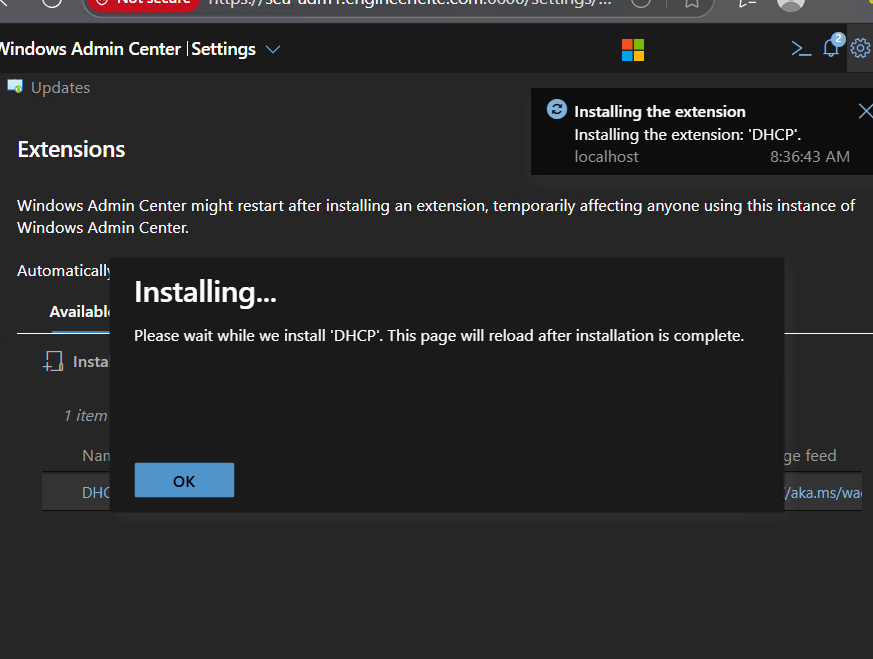
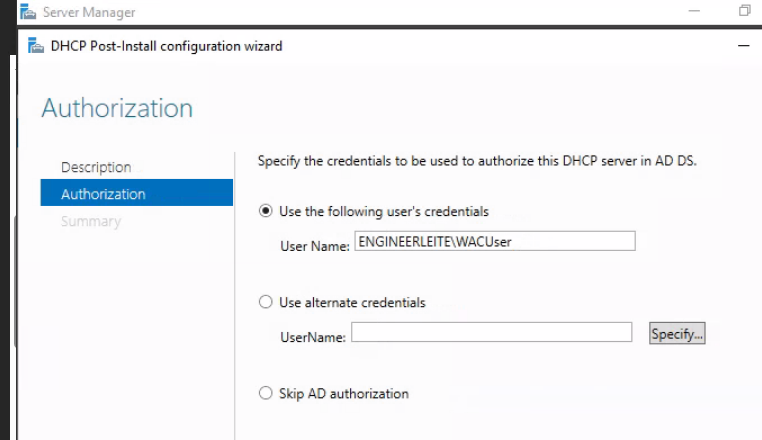
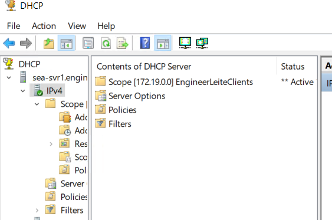
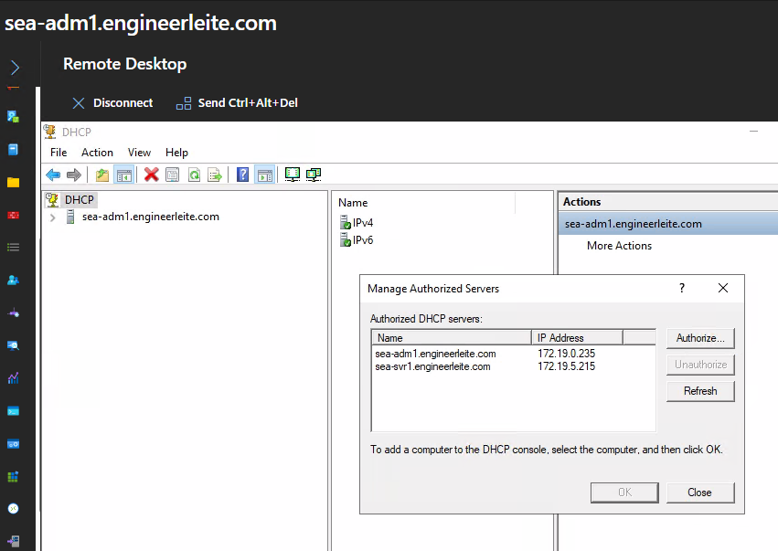
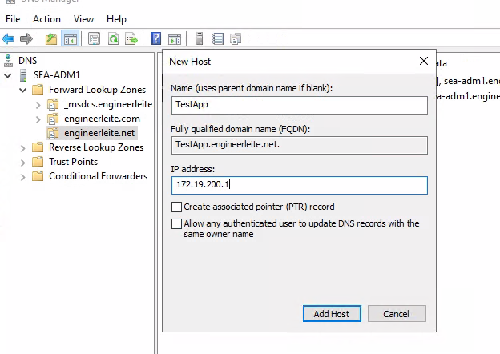
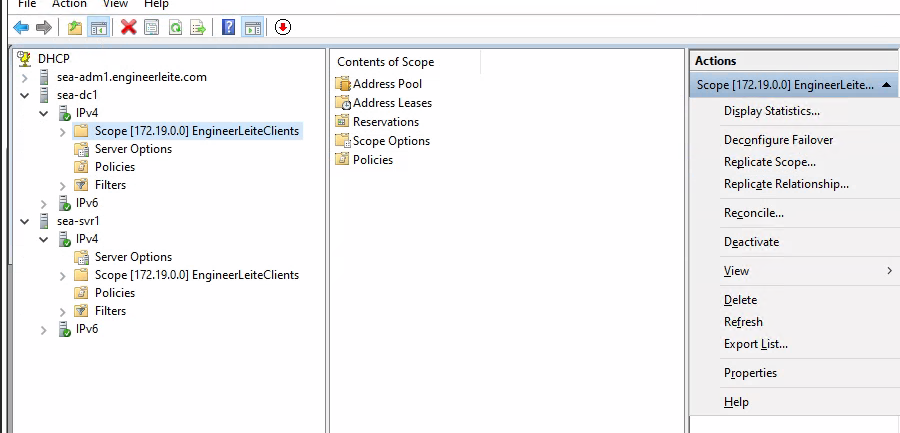
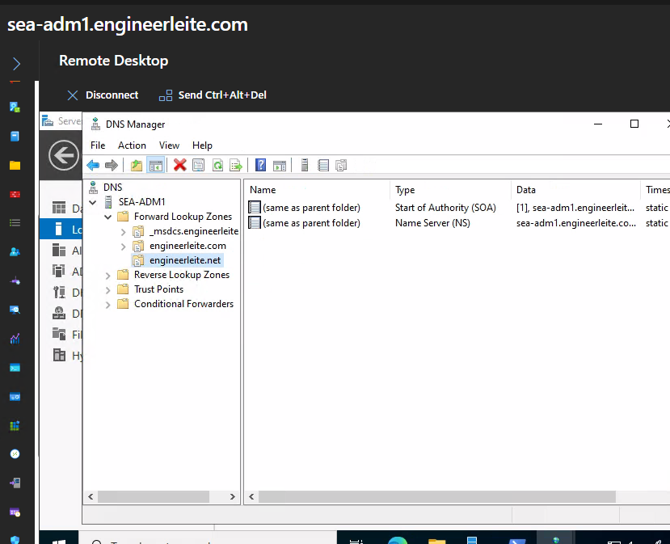
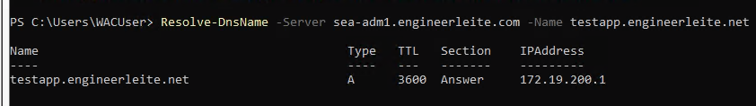
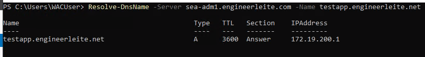

# Lab 07 - Implementing and configuring network infrastructure services in Windows Server

## Introduction
Large organizations often have complex networking requirements. To support these needs, in this lab we will learn how to deploy and configure DHCP with high availability, as well as set up DNS so that companies can operate their own DNS server within a testing environment.

In this lab, I worked with the next AZ-800 skills:

### Manage IP addressing in on-premises and hybrid scenario

    - Implement and configure the Dynamic Host Configuration protocol (DHCP) server role
    - Resolve IP address issues in hybrid environments
    - Create and manage DHCP scopes
    - Create and manage IP reservations
    - Implement DHCP high availability

### Implement on-premises and hybrid name resolution

    - Integrate DNS with AD DS
    - Create and manage DNS zones and records
    - Configure DNS forwarding and conditional forwarding
    - Implement Windows Server DNS policies

## Steps Performed

1. **Deploying and configuring DHCP**

    We'll start by adding the DHCP role from WAC.

    

    Then proceed to install DHCP role for `SEA-SVR1` and `SEA-ADM1` and make sure to include DHCP PowerShell tools.

2. **Authorize the DHCP server**

    We remote in on `SEA-ADM1` and authorize this DCHP server

    

3. **Create a scope**

    For this requirement, we want to lease IPs for a oficine of 200 employees, knowning that my default gateway it's `172.19.0.1`, I'm setting this scope as next below:

    - Protocol: **IPv4**
    - Name: **EngineerLeiteClients**
    - Starting IP address: **172.19.100.10**
    - Ending IP address: **172.19.100.254**
    - DHCP client subnet mask: **255.255.0.0**
    - Router (default gateway): **172.19.0.1**
    - Lease duration for DHCP clients: **4 days**

    

    Now, on `SEA-ADM1`, I want to sure that both servers are available on Manage Authorized Servers:

    

    Then added a new Host (A) Record:

    - DNS record type: Host (A)
    - Record name: TestApp
    - IP address: 172.30.99.234
    - Time to live: 600

    

4. **Configure DHCP Failover**

    Then we'll proceed to create a failover with the next details below:

    - Relationship Name: SEA-SVR1 to SEA-DC1
    - Maximum Client Lead Time: 1 hour
    - Mode: Hot standby
    - Role of Partner Server: Standby
    - Addresses reserved for standby server: 5%
    - State Switchover Interval: Disabled
    - Enable Message Authentication: Enabled
    - Shared Secret: DHCP-Failover

    

5. **Deploying and configuring DNS**

    After installing the DNS Zone role on `SEA-ADM1`, I created a new zone called `engineerleite.net` with the details below:

    - Zone type: Primary
    - Zone name: engineerleite.net
    - Zone file: Create a new file
    - Zone file name: TreyResearch.net.dns
    - Dynamic update: Do not allow dynamic update

    

    Then we test this new record with the command below:

    ```powershell
    Resolve-DnsName -Server sea-adm1.engineerleite.com -Name testapp.engineerleite.net
    ```

    

6. **Configure DNS policies**

    Let's start by creating a client subnet for the DNS server so we can implement these policies

    ```powershell
    Add-DnsServerClientSubnet -Name "HeadOfficeSubnet" -IPv4Subnet '172.19.250.1/24'
    ```

    Then create a zone scope for head office:

    ```powershell
    Add-DnsServerZoneScope -ZoneName 'engineerleite.net' -Name 'HeadOfficeScope'
    ```

    Add a new resource record for the head office scope:

    ```powershell
    Add-DnsServerResourceRecord -ZoneName 'engineerleite.net' -A -Name 'testapp' -IPv4Address '172.19.250.100' -ZoneScope 'HeadOfficeScope'
    ```

    Finally create a new policy that links the head office subnet and the zone scope:

    ```powershell
    Add-DnsServerQueryResolutionPolicy -Name 'HeadOfficePolicy' -Action ALLOW -ClientSubnet 'eq,HeadOfficeSubnet' -ZoneScope 'HeadOfficeScope,1' -ZoneName 'engineerleite.net'
    ```

    We can now test the resolution with the following command:

    ```powershell
    Resolve-DnsName -Server sea-adm1.engineerleite.com -Name testapp.engineerleite.net
    ```

    


## Troubleshooting / Errors Encountered

No errors encountered :)

## Documentation

- https://learn.microsoft.com/en-us/windows-server/networking/technologies/dhcp/quickstart-install-configure-dhcp-server?tabs=powershell
- https://learn.microsoft.com/en-us/windows-server/networking/dns/dns-overview

