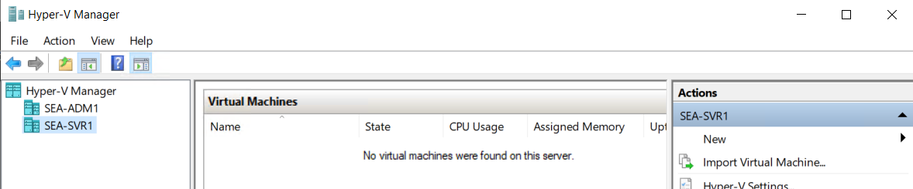
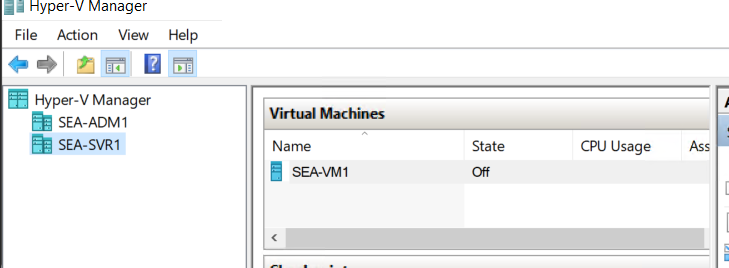
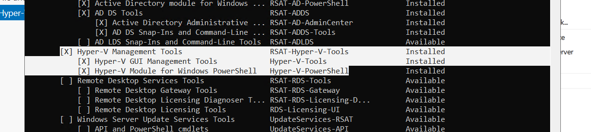
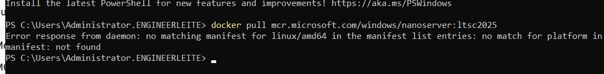

# Lab 05 — Implementing and configuring virtualization in Windows Server

## Introduction
In a global engineering scenarios, many physical servers are being currently underutilized by company plans to expand virtualization due to many benefits in contrast to on-premises hardware.

Because of this, on this lab we want to practice the implementation of Hyper-V and how can be used to manage virtual machine environment and explore the container technology to understand how can help to reduce deployment times for new applications and simplify moving applications to the cloud.

In this lab, I worked with the next AZ-800 skills:

### Manage Hyper-V and guest virtual machines
    - Enable Enhanced session mode
    - Manage VMs using PowerShell remoting, PowerShell Direct and Secure Shell (SSH) Direct for Linux VMs
    - Enable nested virtualization
    - Configure VM memory
    - Configure integration services
    - Configure Discrete Device Assignment
    - Manage Hyper-V virtual hard disks
    - Configure Hyper-V Network Adapter
    - Configure Hyper-V Switch

### Create and manage containers

    - Prepare Windows Server as a container host
    - Configure Windows subsystem for Linux to support containers for running Linux
    - Create Windows Server container images
    - Manage Windows Server container images
    - Configure container networking
    - Manage container instances

## Objetives
- Create and configure VMs.
- Install and configure containers.

## Steps Performed

1. **Enable nested virtualization on host**

    On the host machine, enable nested virtualization for the specific VM by running:

    ```powershell
    Set-VMProcessor -VMName "SEA-SVR1"-ExposeVirtualizationExtensions
    $true
    ```

    Then start SEA-SVR1 and install the Hyper-V feature inside the VM:

    ```powershell
    Enable-WindowsOptionalFeature -Online -FeatureName Microsoft-Hyper-V -All
    ```

    

2. **Installing and managing virtual machines**

    For this step, we will create the following virtual components on `SEA-SVR1`, and to make it more interesting, we’ll do it remotely from `SEA-ADM1`:

    - Virtual Network Switch
    - Virtual Hard Disk
    - Virtual Machine

    First, we need to connect to `SEA-SVR1`. To resolve connection issues, I reran `winrm quickconfig` and successfully established the remote connection:

    

    Next, I created a Hyper-V Virtual Switch with the following configuration:

    - Name: Private Switch
    - Connection type: Private network

    Then, I created a virtual machine on `SEA-SVR1` using these settings:

    - Name: SEA-VM1
    - Generation: Generation 1
    - Memory: 4096
    - Networking: Private Switch
    - Hard disk: C:\HOME\SEA-VM1.vhdx
    - Dynamic Memory with 4096 Maximum RAM

    This concludes the installation process for nested virtualization and remote virtualization

    

3. **Installing and configuring containers**

    Next, we'll install Docker on our Windows Server. According to the documentation, we first need to enable WSL by running:

    ```powershell
    wsl.exe --install
    wsl --update
    ```

    After WSL is installed and updated, download and install Docker Desktop from the official website.

    Once the installation completes, restart the server. After rebooting, you can verify Docker functionality by listing available images:

    ```powershell
    docker images
    ```

    To download the Nano Server image, use:

    ```powershell
    docker pull mcr.microsoft.com/windows/nanoserver:ltsc2025
    ```

    To launch a container based on this image:
    
    ```powershell
    docker run -it mcr.microsoft.com/windows/nanoserver:ltsc2022 cmd.exe 
    ```

    Inside the container, create a text file using:

    ```powershell
    echo "Hello World!" > C:\Users\Public\Hello.txt
    ```

    Finally, to display the contents of the file from a temporary container (which deletes itself after execution), run:

    ```powershell
    docker run --rm helloworld cmd.exe /s /c type C:\Users\Public\Hello.txt
    ```


## Troubleshooting / Errors Encountered

### Missing Hyper-V Manager on Vms
**Error:**
Hyper-V Manager did not appear on SEA-ADM1 even after installing the Hyper-V feature.

**Cause:**
The issue occurred because the `Hyper-V Management Tools` were not installed. After installing the GUI management tools, Hyper-V Manager became available.



### Error response from daemon: no matching manifest for linux/amd64 in the manifest list entries: no match for platform in manifest: not found
**Cause:**
This error occurs because Docker is currently configured to use Linux containers, but the image you're trying to pull is Windows-only. Since the image does not include a `linux/amd64` variant, Docker cannot find a matching manifest and returns this error.

Switch Docker from Linux containers to Windows containers by selecting “Switch to Windows Containers” from the Docker menu.



## Documentation
- https://learn.microsoft.com/en-us/windows/wsl/install-on-server
- https://learn.microsoft.com/en-us/virtualization/windowscontainers/quick-start/set-up-environment?tabs=dockerce#windows-server-1
- https://www.docker.com/products/docker-desktop/
- https://hub.docker.com/r/microsoft/windows-nanoserver